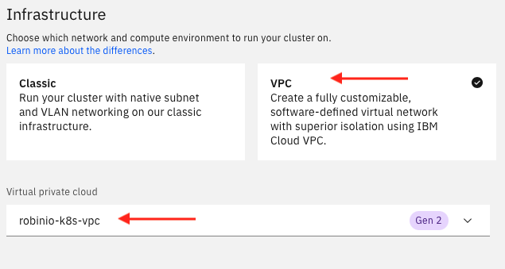
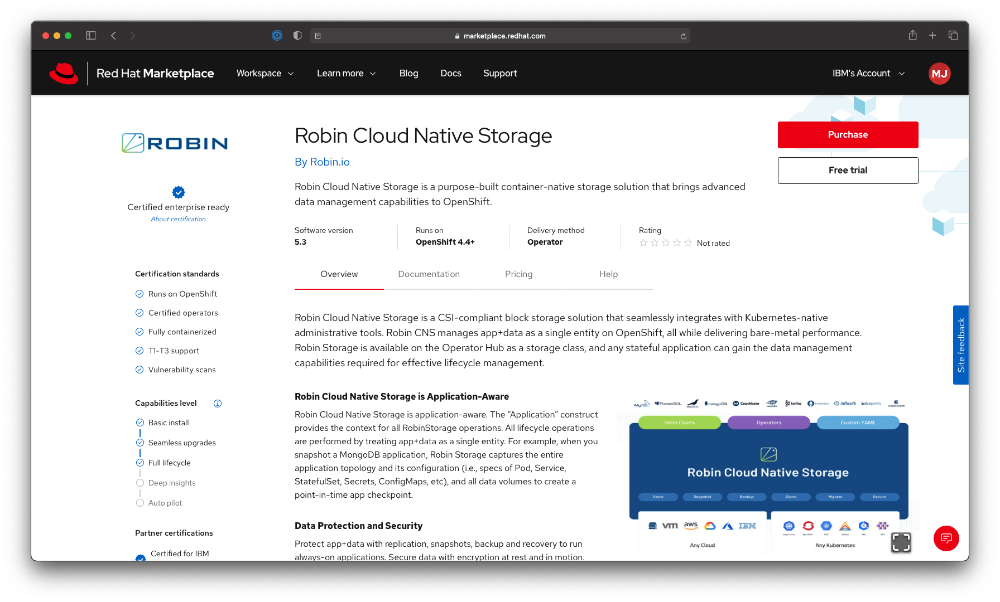

---
#Front matter (metadata).
abstract:  Setup Robin Cloud Native Storage on IBM Kubernetes and Red Hat OpenShift 

authors:                # REQUIRED - Note: can be one or more
  - name: Manoj Jahgirdar
    email: manoj.jahgirdar@in.ibm.com
  - name: Muralidhar Chavan
    email: muralidhar.chavan@in.ibm.com

completed_date:         # REQUIRED - Note: date format is YYYY-MM-DD

components:
# For a full list of options see https://github.ibm.com/IBMCode/Definitions/blob/master/components.yml
# Use the "slug" value found at the link above to include it in this content.
# Example (remove the # to uncomment):
 # - "aix"

draft: true|false       # REQUIRED

excerpt:  Setup Robin Cloud Native Storage on IBM Kubernetes and Red Hat OpenShift

keywords:              ISV, Cloud Native Storage

last_updated:           # REQUIRED - Note: date format is YYYY-MM-DD

primary_tag:         "containers"  

pta:                     "cloud, container, and infrastructure"
# For a full list of options see https://github.ibm.com/IBMCode/Definitions/blob/master/primary-technology-area.yml
# Use the "slug" value found at the link above to include it in this content.
# Example (remove the # to uncomment):
 # - "cloud, container, and infrastructure"

pwg:                    "containers"
# For a full list of options see https://github.ibm.com/IBMCode/Definitions/blob/master/portfolio-working-group.yml
# Use the "slug" value found at the link above to include it in this content.
# Example (remove the # to uncomment):
# - "containers"

related_content:        # OPTIONAL - Note: zero or more related content
  - type: announcements|articles|blogs|patterns|series|tutorials|videos
    slug:

related_links:           # OPTIONAL - Note: zero or more related links


runtimes:               # OPTIONAL - Note: Select runtimes from the complete set of runtimes below. Do not create new runtimes. Only use runtimes specifically in use by your content.
# For a full list of options see https://github.ibm.com/IBMCode/Definitions/blob/master/runtimes.yml
# Use the "slug" value found at the link above to include it in this content.
# Example (remove the # to uncomment):

series:                 # OPTIONAL
 - type:
   slug:

services:               # OPTIONAL - Note: please select services from the complete set of services below. Do not create new services. Only use services specifically in use by your content.
# For a full list of options see https://github.ibm.com/IBMCode/Definitions/blob/master/services.yml
# Use the "slug" value found at the link above to include it in this content.
# Example (remove the # to uncomment):


subtitle:   Get started with Robin Cloud Native Storage solutions on Kubernetes and OpenShift

tags:
# Please select tags from the complete set of tags below. Do not create new tags. Only use tags specifically targeted for your content. If your content could match all tags (for example cloud, hybrid, and on-prem) then do not tag it with those tags. Less is more.
# For a full list of options see https://github.ibm.com/IBMCode/Definitions/blob/master/tags.yml
# Use the "slug" value found at the link above to include it in this content.
# Example (remove the # to uncomment):
 # - "blockchain"

title:                  Setup Robin Cloud Native Storage on IBM Kubernetes and Red Hat OpenShift
translators:             # OPTIONAL - Note: can be one or more
  - name:
    email:

type: tutorial|howto    # REQUIRED

---


# Setup Robin Cloud Native Storage on IBM Kubernetes and Red Hat OpenShift

## Introduction
[Robin Cloud Native Storage](https://get.robin.io/) (CNS) is an application-aware container storage that offers advanced data management capabilities and runs natively on any Kubernetes distribution including IBM Kubernetes Service (IKS), Red Hat OpenShift Kuernetes Service (ROKS), stand-alone OpenShift, etc. Robin Cloud Native Storage delivers bare-metal performance and enables you to protect (via snapshots, backups), secure (via encryption), collaborate (via clones and git like push/pull workflows), and make portable (via cloud-sync) any stateful application that is deployed using helm charts or operators.

This tutorial provides detailed steps to install Robin CNS on IBM Kubernetes service as well as OpenShift on IBM Cloud. It also covers provisioning of drives on these clusters.

This tutorial will help developers looking for:
- Setting up Robin CNS
- Cloud native storage solutions

Both these areas are covered with detailed steps.

## Prerequisites
In order to follow the steps outlined in this tutorial, users need to have the following setup.

1. [IBM Cloud Account](https://cloud.ibm.com/registration): Create an IBM Cloud account.
2. [IBM Cloud CLI](https://cloud.ibm.com/docs/cli?topic=cloud-cli-getting-started&locale=en-US): Download and Install IBM Cloud CLI tool.
3. [kubectl CLI](https://cloud.ibm.com/docs/containers?topic=containers-cs_cli_install#kubectl): Download and Install Kubectl CLI tool.
4. [OC CLI](https://docs.openshift.com/container-platform/4.6/cli_reference/openshift_cli/getting-started-cli.html): Download and Install OpenShift CLI tool.

## Estimated time
With prerequisites in place, this tutorial should take about 20 min to complete.
>Note: The estimated time is excluding cluster provisioning.

## Steps

### Step 1: Provision a Virtual Private Cloud (VPC Gen 2) instance on IBM Cloud
You will have to enable access specific ports for the Robin installation to succeed and for Robin to operate correctly.

Hence Kubernetes or OpenShift has to be installed on top of a VPC and not on Classic infrastructure.

- Login to IBM Cloud, and [Create a VPC](https://cloud.ibm.com/vpc-ext/provision/vpc). Ensure you **Attach** Public gateway as it is required to install Robin CNS.


>NOTE: We have provisioned two VPC one for Kubernetes cluster and another for OpenShift cluster. The VPC configurations for both the clusters remains the same.

- Once the VPC is provisioned, enable the following ports:

    Ports|Description
    --|--
    29442 - 29470|Robin services
    30000 - 32767|IKS Access Ports

- Visit the [Virtual Private Clouds Dashboard](https://cloud.ibm.com/vpc-ext/network/vpcs) and select your VPC.

- In your VPC overview page, select the **Default Security Group** as shown.


- Under the **Rules** tab, in the **Inbound rules** section, click on **Create** to create a new inbound rule.

- Specify the following details in the new inbound rules section:
    - Protocol: TCP
    - Port: Port range
        - Port min: **29442**
        - Port max: **29470**
    - Source type: Any

    

- Similarly, create another inbound rule with the following details:
    - Protocol: TCP
    - Port: Port range
        - Port min: **30000**
        - Port max: **32767**
    - Source type: Any

    

At this point, you will have successfully:
- created a VPC infrastructure
- exposed the ports required for Robin

### Step 2: Create Kubernetes or OpenShift clusters on IBM Cloud VPC
Once you have setup the VPC infrastructure, you can now install Kubernetes or OpenShift on your VPC.

#### 2.1: Create Kubernetes cluster
- Login to IBM Cloud, and create a [Kubernetes cluster](https://cloud.ibm.com/kubernetes/catalog/create). Select the specifications as listed below:
    - **Plan details:** Standard
    - **Orchestration service:** Kubernetes
    - **Infrastructure:** Make sure you select **VPC** infrastructure that you created in step 1.
    
    - **Location:** default
    - **Worker pool:** Make sure you have **at least 3 worker nodes** as it is recommended by Robin
    
    - **Resource details:** Enter a name for your cluster

>NOTE: It will take approximately 30min to provision the Kubernetes cluster.

- Once the Kubernetes cluster is provisioned, you can connect to the cluster via CLI. Go to [Kubernetes cluster dashboard](https://cloud.ibm.com/kubernetes/clusters) and select the cluster that you created. Click on **Access** tab on the left panel and follow the on screen instructions to connect to the cluster through your terminal.

#### 2.2: Create OpenShift cluster
- Before creating an OpenShift cluster, you will have to create a Cloud Object Storage. Login to IBM Cloud, and create a [Cloud Object Storage](https://cloud.ibm.com/objectstorage/create) with **Standard** plan.
- Login to IBM Cloud, and create a [Red Hat OpenShift cluster](https://cloud.ibm.com/kubernetes/catalog/create?platformType=openshift). Select the specifications as listed below:
    - **Orchestration service:** OpenShift 4.6.23
    - **OCP entitlement:** If you have an OCP entitlement license you can select **Apply my Cloud Pak OCP entitlement**, else select the default **Purchase additional licenses**
    - **Infrastructure:** Make sure you select **VPC** infrastructure that you created in step 1 and the **cloud object storage** that you created in step 2.2.
    
    - **Location:** default
    - **Worker pool:** Make sure you have **at least 3 worker nodes** as it is recommended by Robin
    
    - **Resource details:** Enter a name for your cluster

>NOTE: It will take approximately 30min to provision the OpenShift cluster.

- Once the OpenShift cluster is provisioned, you can connect to the cluster via CLI. Go to [Kubernetes cluster dashboard](https://cloud.ibm.com/kubernetes/clusters) and select the OpenShift cluster that you created. Click on **Actions** tab on the top right, select the **Connect via CLI**. In the opened panel, click on the **oauth token request page**. You will be redirected to a different page. On that page click on **Display Token** to get an `oc login` token. Copy paste the command in your terminal and you will be connected to the OpenShift cluster.

>Example Token: `oc login --token=sha256~xxxx --server=https://xxxx.xx.containers.cloud.ibm.com:30716`

At this point, you will have successfully:
- created a VPC infrastructure
- exposed the ports required for Robin
- created a Kubernetes cluster or OpenShift cluster
- connected to the cluster from your terminal

### Step 3: Create IBM Cloud API key
You will need an IBM Cloud API key to install Robin CNS on IBM Cloud based Kubernetes or OpenShift. In this step you will learn how to create an IBM Cloud API Key.

- Go to [Manage access users > API keys](https://cloud.ibm.com/iam/apikeys), click on **Create an IBM Cloud API key**. Enter name and description of the api key and click on **Create**.


- Once the API Key is created, download the key as it will be required in the subsequent steps.

>NOTE: You need to download the API Key to keep it with you and view anytime. Once the dialog box is dismissed in the dashboard, you cannot view the API Key on the dashboard.

### Step 4: Setup Robin on Kubernetes
In this section you will learn to download, install, and activate Robin CNS on Kubernetes.

#### 4.1: Download Robin CNS installer
- Goto [get.robin.io](https://get.robin.io), and enter your email id. Click on **Sign in to Download**.


- Check your email you, will have received a one-time login link. Open the link and enter your email id once again. Click on **Sign in**.


- You will receive another email with one-time login link on your email address. Click on the link to log in to your account and download the Robin CNS installer. 

>NOTE: The link is only valid for 15 minutes.

- Once logged in, you will be presented to the [Robin Home Page](https://get.robin.io/home).


- Go to the [Download Robin Cloud Native Storage](https://get.robin.io/download) to download installer.

    
- Click on **Download and Install** under the **Deploy on IBM IKS** section to download Robin CNS for Kubernetes


- A curl and wget command will be displayed, copy and paste the command in your terminal to download the Robin CNS.

>Example Command: 
    >```
    > wget "http://get.robin.io/download/storage?id=<your-id>&type=iks" -O robin-install.tar
    >```
    >```
    > curl -L "http://get.robin.io/download/storage?id=<your-id>&type=iks" -o robin-install.tar
    >```

- Also go to [get.robin.io/activate](https://get.robin.io/activate) and copy the USERID in a notepad as it will be required in subsequent steps.


>Example: `robin license activate XXXXXXXX` copy the `XXXXXXXX` which is your USERID.

#### 4.2: Install Robin CNS
- Extract the `robin-install.tar` into a directory `robin`, In terminal run the following command:
    ```bash
    $ mkdir -p ./robin && tar -xf robin-install.tar -C ./robin
    ``` 

- Go to the newly created `robin` directory and run the shell script, In terminal run the following command:
    
    - Get the Robin CNS version number:
        ```bash
        $ cd ./robin
        $ cat robin.yaml | grep robinsys/robinimg
        ```
    
        ```
        image_robin: robinsys/robinimg:5.3.4-75
        ``` 
    - Run the following command with the above version number.
        ```bash
        $ ./install-robin.sh --version=5.3.4-75
        ```

- You will be asked for **IBM api key**, enter the IBM Api Key which you downloaded in step 3.
    ```
    Validating Kubernetes cluster......Done
    Enter IBM api key: XXXXXXXX
    Validating kubernetes cluster permissions......Done
    Validating robin cluster yaml......Done
    Installing Robin operator...........Done
    Installing Robin cluster............Done
    Setting up robin client............Done
    Activate robin license............Required
    *****
    ***** Your ROBIN License is NOT ACTIVATED...
    ***** Please register at https://get.robin.io/activate
    ***** to activate your license and access all ROBIN features.
    *****
        $ robin license activate <USERID>
        Note: You can get your User ID after registering on https://get.robin.io. Above command will only work if the host on which the
                ROBIN client is running on has an internet connection. If this is not the case please retrieve the license key by using the
                below link and apply it using the command 'robin license apply <key>'.
                https://get.robin.io/activate?clusterid=YGVgYGggYWFj.GkhY00fYWBcZ1ccYF8oNF0DQDQ7XEMxPyf1XGFeZlVgYVz5PzU1Qy7xPWjj.XZoclkjXWNcYFwgYWRoJA__
        For logging into robin cluster,
        Default username: admin
        Default password: Robin123
    ```

- It will take about 10-15 min to install Robin CNS on your cluster.

- **NOTE:** If the installation freezes at `Setting up robin client............` for a long time, you can run the `kubectl describe` or `oc describe` command given in the next point to verify the status of all the pods. If the status is **running**, Robin CNS has been installed successfully.

- In new Terminal, run the following command to verify `running` status of the robin pods.
    ```bash
    $ kubectl get pods -n robinio
    ```
    ```
    NAME                                     READY   STATUS    RESTARTS   AGE
    csi-attacher-robin-5b4f68d79b-j4g54      3/3     Running   0          23d
    csi-nodeplugin-robin-nmgfj               3/3     Running   0          23d
    csi-nodeplugin-robin-q65z6               3/3     Running   0          23d
    csi-nodeplugin-robin-q6ww7               3/3     Running   0          23d
    csi-provisioner-robin-75fd9ff95f-9r6cx   3/3     Running   0          23d
    csi-resizer-robin-787cd495d5-ncccp       3/3     Running   0          23d
    csi-snapshotter-robin-0                  3/3     Running   0          23d
    robin-5c5dw                              1/1     Running   0          23d
    robin-85pnq                              1/1     Running   0          23d
    robin-operator-6b94489778-x45xk          1/1     Running   0          23d
    robin-pjfpq                              1/1     Running   0          23d
    ```

- You will see all the pods up and running, which confirms the Robin CNS has been installed successfully.

- Also run the `describe` command to verify `Ready` status of the `Phase` field to confirm that Robin CNS has been installed successfully.
    ```bash
    $ kubectl describe robincluster -n robinio
    ```
    ```
    Name:         robin
    Namespace:    robinio
    Labels:       app.kubernetes.io/instance=robin
                app.kubernetes.io/managed-by=robin.io
                app.kubernetes.io/name=robin
    Annotations:  kubectl.kubernetes.io/
    API Version:  manage.robin.io/v1
    Kind:         RobinCluster

    ...

    Phase:             Ready
    pod_status:
        robin-85pnq  10.240.64.4  Running  10.240.64.4
        robin-5c5dw  10.240.64.6  Running  10.240.64.6
        robin-pjfpq  10.240.64.5  Running  10.240.64.5
    
    ...
    
    ```

#### 4.3: Access Robin client
- In terminal, run the following command to get the connection command:
    ```bash
    $ kubectl describe robincluster -n robinio | grep "kubectl exec"
    ```
    ```
    connect_command: kubectl exec -it robin-85pnq -n robinio -- bash
    ```

- Copy the command and paste it in terminal to enter the Robin pod and start accessing the Robin client.
    ```bash
    $ kubectl exec -it robin-85pnq -n robinio -- bash
    ```

- Notice that your terminal prompt will be changed to the robin pod prompt.
    ```bash
    [robinds@kube-c1ima1bd0o105lencd5g-robiniooscl-default-0000029e ~]#
    ```

#### 4.4: Activate Robin client
- In terminal, under the robin prompt, run the `robin login` command with default username as `admin` and password as `Robin123`:
    ```
    [robinds@kube-c1ima1bd0o105lencd5g-robiniooscl-default-0000029e ~]# robin login admin
    Password: 
    User admin is logged into Administrators tenant
    [robinds@kube-c1ima1bd0o105lencd5g-robiniooscl-default-0000029e ~]#
    ```
- You are now logged in to Robin client, now you can activate it with the activation code copied in step 3.2. In terminal run the following command:
    ```
    [robinds@kube-c1ima1bd0o105lencd5g-robiniooscl-default-0000029e ~]# robin license activate <USERID>
    ```

    ```
    License has been applied successfully
    ```

- At this point, you will have successfully logged into robin client and activated it.

### Step 5: Setup Robin on OpenShift through Red Hat Marketplace
In this section you will learn to install Robin CNS operator on your openshift cluster from Red Hat Marketplace.

- In terminal, run the following command to create a `robinio` namespace in OpenShift and initialize it with IBM Cloud API key secret.
    ```
    $ oc new-project robinio
    ```

- Add the IBM Cloud API key copied in step 3 to the `robinio` namespace. In terminal run the following command.
    ```
    $ oc create secret generic cloud-cred-secret --from-literal=api_key=<API KEY> -n robinio
    ```

- Once the namespace is created and the IBM Cloud API key secret is in place, you can proceed with installing the operator from OpenShift.

- Follow the tutorial to [Register your OpenShift cluster on Red Hat Marketplace](https://developer.ibm.com/tutorials/configure-a-red-hat-openshift-cluster-with-red-hat-marketplace/) before you start.

- Once the cluster is registered on RHM, make sure to **Replace** the worker nodes of your OpenShift cluster by going to [Kubernetes cluster dashboard](https://cloud.ibm.com/kubernetes/clusters) and select the OpenShift cluster that you created. On the left panel select **Worker nodes**. Select all the nodes and click on **Replace**. This will take about an hour to replace the nodes.


>Note: This replace step is required only for IBM Cloud managed OpenShift cluster, this step may be skipped for AWS or GCP managed OpenShift cluster.

- After the OpenShift cluster is back online, goto the [Red Hat Marketplace](https://marketplace.redhat.com/en-us) and search for **Robin**.

- Select the [Robin Cloud Native Storage](https://marketplace.redhat.com/en-us/products/robin-storage).

- The Robin Cloud Native Storage product page gives you an overview, documentation, and pricing options associated with the product. Select the **Free Trial** button.


- Next, the purchase summary will show the Subscription term, with a total cost of $0.00. Click **Start trial**.


- Visit [Workspace > Software](https://marketplace.redhat.com/en-us/workspace/software) to view your list of purchased software.

- Select Robin Cloud Native Storage and then click the **Operators tab**. Select the **Install operator** button. Leave the default selection for Update channel and Approval strategy. Select the cluster and namespace scope as `robinio` for the operator and click **Install**.


- You can check the progress of the installation on your OpenShift cluster. Go to [Kubernetes cluster dashboard](https://cloud.ibm.com/kubernetes/clusters) and select the OpenShift cluster that you created. Click on **OpenShift web console** to launch the OpenShift console.

- Under **Operators** in the left panel, select **Installed Operators**. Make sure you are in the  project `robinio` to view the status of the Robin CNS installation.


- Once the status is **Succeeded**, click on the operator name to open the operator page. Under **Details** > **Provided APIs**, click on the **Create Instance** to create a Robin Cluster.


- In the Create RobinCluster page, select the **YAML View**.


- In the YAML file, change the `host_type` to `ibm` and add the following key value pairs at the end of the YAML file as shown.
    ```
    cloud_cred_secret: cloud-cred-secret
    update_etc_hosts: "1"
    ```
    

    > Note: `update_etc_hosts: "1"` is specific only to IBM managed OpenShift cluster.

- Click on **Create** to create the Robin Cluster.
    >Note: It will take about 5mins to create the cluster.

- Once the status of the Robin cluster becomes **Ready** you have successfully installed Robin CNS on OpenShift.


- Click on the Robin cluster name to view more details about Robin CNS. Copy the Robin **Connect Command** and run it in your terminal.


    ```
    $ kubectl exec -it robin-dzlch -n robinio -- bash
    ```

- Notice that your terminal prompt will be changed to the robin pod prompt.
    ```bash
    [robinds@kube-c1ima1bd0o105lencd5g-robiniodzlch-default-0000029e ~]#
    ```

- In terminal, under the robin prompt, run the `robin login` command with default username as `admin` and password as `Robin123`:
    ```
    [robinds@kube-c1ima1bd0o105lencd5g-robiniodzlch-default-0000029e ~]# robin login admin
    Password: 
    User admin is logged into Administrators tenant
    [robinds@kube-c1ima1bd0o105lencd5g-robiniodzlch-default-0000029e ~]#
    ```

- At this point, you will have successfully logged into robin client.

### Step 6: Provision Storage 
Robin discovers disks attached to the nodes and uses them for providing storage to applications. Storage on IKS and ROKS clusters can be provisioned dynamically. You can either use IBM Cloud provided utilities or alternatively you can utilize Robin utility to provision and attach disks in IBM Cloud to use for application deployment

- Robin provides a utility through which it can provision disks of any size, attach them to hosts and discover them automatically on multiple cloud platforms. This enables users to expand the storage available for their cluster with convenience and ease.

- Drive can be created using the command `robin drive create`. Explore options for this command using `robin drive create --help`

    ```
    [robinds@kube-c1ima1bd0o105lencd5g-robiniooscl-default-0000029e ~]# robin drive create --help
    usage: robin disk create [-h] [--type TYPE] [--number NUMBER] [--size SIZE]
                            [--iops [100-160000]] [--wait]
                            [--mount-path MOUNT_PATH]
                            hostname

    positional arguments:
    hostname              Hostname on which the disk(s) will be attached. For
                            appropriate hostnames please check the output of robin
                            host list.

    optional arguments:
    -h, --help            show this help message and exit
    --type TYPE           GCP valid disks: pd-ssd, pd-standard. AWS valid disks:
                            gp2, io1, st1. Azure valid disks: premium, standard.
                            Anthos valid disks: independent_persistent. IBM valid
                            disks: general-purpose, 5iops-tier, 3iops-tier, custom
                            (must provide --iops for 'custom')
    --number NUMBER       Number of disks to be created. Default value is 1.
    --size SIZE           Specify the size of the disk(s) you want to create in
                            GB. The default value is 500 GB.
    --iops [100-160000]   IOPs for AWS 'io1' disk type and Azure 'ultrassd' disk
                            type. Default value is based on the type of disk.
    --wait                Run this command in the background
    --mount-path MOUNT_PATH
                            Specify a comma seperated set of mount path(s) for the
                            disk(s) to be created. Note this option is only valid
                            for AWS disks and each specified path must start with
                            '/dev/sd'.
    ```

- You will notice that IBM valid disks are `general-purpose`, `5iops-tier`, `3iops-tier`, `custom`  (must provide --iops for 'custom').

- The disks are attached to hostnames. You can get hostnames using the below command:
    ```
    [robinds@kube-c1ima1bd0o105lencd5g-robiniooscl-default-0000029e ~]# robin host list
    ```

    ```
    Id           | Hostname                                               | Version  | Status | RPool   | LastOpr | Roles | Isol Shared Cores | Isol Dedicated Cores | Non-Isol Cores | GPUs  | Mem       | HDD(#/Alloc/Total) | SSD(#/Alloc/Total) | Pod Usage | Joined Time
    -------------+--------------------------------------------------------+----------+--------+---------+---------+-------+-------------------+----------------------+----------------+-------+-----------+--------------------+--------------------+-----------+----------------------
    1617705466:1 | kube-c1ima1bd0o105lencd5g-robiniooscl-default-0000029e | 5.3.4-75 | Ready  | default | ONLINE  | M*,S  | 0/0/0             | 0/0/0                | 37/3/40        | 0/0/0 | 9G/6G/15G | 3/-/60G            | -/-/-              | 50/50/100 | 06 Apr 2021 00:38:11
    1617705466:2 | kube-c1ima1bd0o105lencd5g-robiniooscl-default-000001e1 | 5.3.4-75 | Ready  | default | ONLINE  | S,M   | 0/0/0             | 0/0/0                | 36/4/40        | 0/0/0 | 8G/6G/15G | 2/-/40G            | -/-/-              | 54/46/100 | 06 Apr 2021 00:38:51
    1617705466:3 | kube-c1ima1bd0o105lencd5g-robiniooscl-default-000003f7 | 5.3.4-75 | Ready  | default | ONLINE  | M,S   | 0/0/0             | 0/0/0                | 36/4/40        | 0/0/0 | 8G/7G/15G | 2/12G/40G          | -/-/-              | 55/45/100 | 06 Apr 2021 00:38:55

    ```
- You can provision robin drives for any of the hostnames. Robin recommends atleast 3 drives for each hostnames. In Terminal run the following command to create robin drive.
    ```
    [robinds@kube-c1ima1bd0o105lencd5g-robiniooscl-default-0000029e ~]# robin drive create kube-c1ima1bd0o105lencd5g-robiniooscl-default-0000029e --type general-purpose --number 3 --size 20
    ```
- This command provisions `three` `20GB` disks of type `general-purpose` and attach to hostname `kube-c1ima1bd0o105lencd5g-robiniooscl-default-0000029e`. Similarly you can provision more drives to the same hostname or different hostnames.

- These disks will be attached automatically and auto discovered by Robin so they will be ready to use straightaway.


## Summary
In this tutorial, you learnt how to set up Robin CNS for both IKS and ROKS on IBM Cloud. In addition, you also how to provision a disk for the clusters. You are now ready to use Robin CNS to implement your cloud storage solutions.

For further exploration, refer [Robin series link].


## Related links
1. [Robin CNS Documentation](https://docs.robin.io/storage/5.3.4/)
2. [Enable ports in IBM Cloud VPC](https://cloud.ibm.com/docs/containers?topic=containers-vpc-network-policy)
